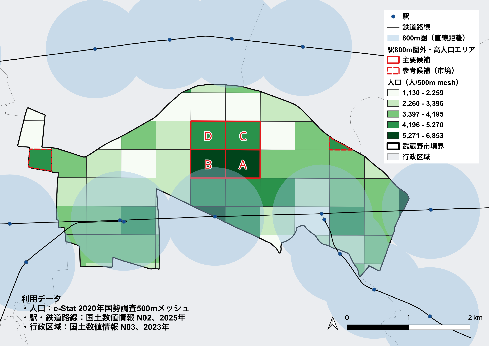
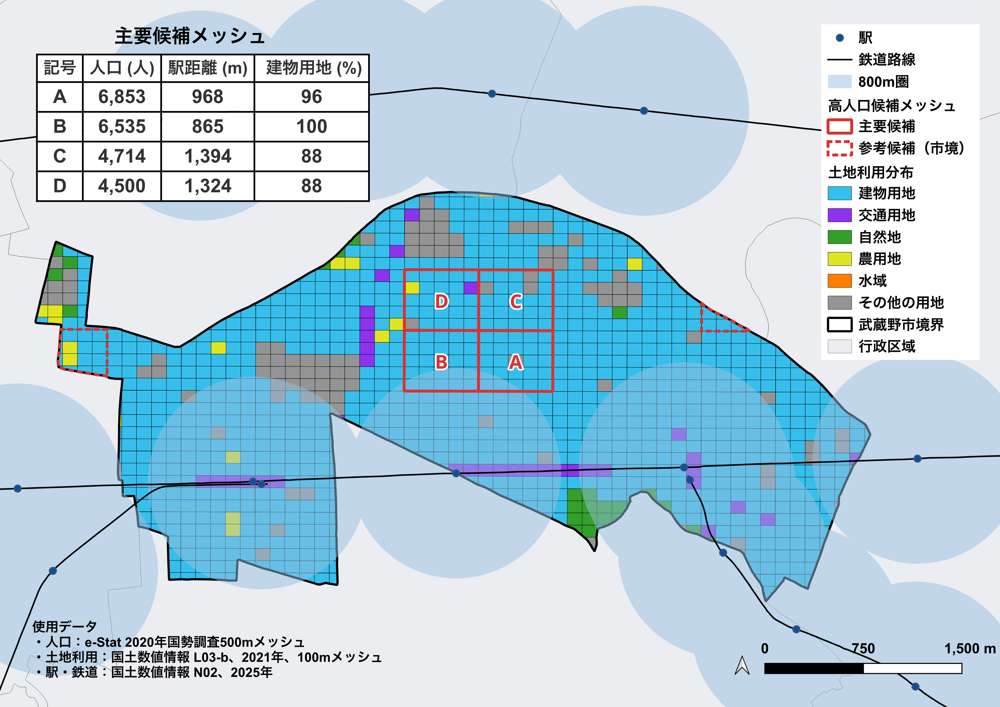
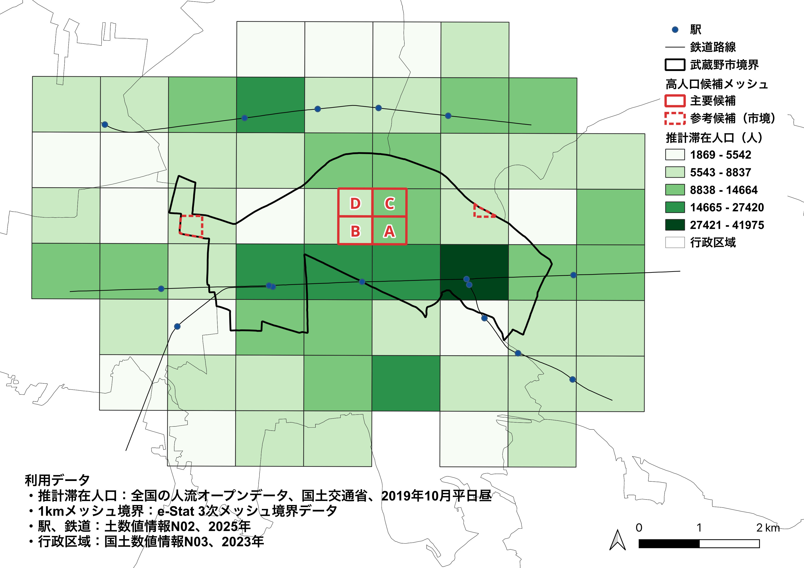

# 武蔵野市における鉄道駅距離と居住人口の空間分析

人口が多く、鉄道駅までの直線距離が800mを超える地域を抽出し、土地利用と平日昼間の推計滞在人口を照合したGIS分析ポートフォリオです。QGISで空間データを処理・可視化し、Pythonで属性データの検証・再集計と距離閾値の比較を行いました。

**対象69メッシュから候補6件を抽出しました。市境をまたぐ参考候補2件を除く主要候補4件は、市北部中央に隣接し、最寄り駅はいずれも三鷹駅でした。** 本分析は、徒歩経路やバスサービスを追加確認する地域を整理するための探索的な分析です。

作成者：吉田 悟志  
分析対象：東京都武蔵野市と周辺  
実施時期：2026年9月

## 成果物

初めてご覧になる方は、応募用サマリーからご確認ください。

| 成果物                                       | 内容                                         |
| -------------------------------------------- | -------------------------------------------- |
| [応募用サマリー](docs/musashino_summary.pdf) | 主な結果・方法・限界と補足地図               |
| [詳細レポート](docs/musashino_report.pdf)    | 分析設計・処理・結果と考察                   |
| [データ一覧](docs/data_inventory.md)         | 利用データと出典の整理                       |
| [QGISプロジェクト](qgis/)                    | 各分析段階のプロジェクト                     |
| [Pythonコード](scripts/day09_check.py)       | 入力検証・候補再抽出・人口統計・距離閾値比較 |
| [Python実行結果](outputs/day09/)             | 候補一覧・集計表・実行情報                   |

## 分析課題と候補の定義

中心となる問いは、**「居住人口が多く、鉄道駅への直線距離が長い地域はどこか」**です。

- 対象：武蔵野市と交差する500m人口メッシュ69件。
- 駅の対象範囲：市外駅の利用も考慮し、市境から1.5kmの周辺範囲を設定。
- 距離：市境でクリップする前の完全500mメッシュ代表点から、最寄り駅代表点までの直線距離。
- 高人口：対象69件の人口第3四分位点（P75）として採用した **4,420人以上**。
- 駅圏外：直線距離 **800m超**。800mちょうどは圏内。
- 主要候補：高人口かつ駅圏外で、メッシュ全体が武蔵野市内にあるもの。
- 参考候補：同じ条件を満たすが、市境をまたぐもの。

800mは候補抽出用の設定値であり、実際の徒歩時間や交通不便の判定基準ではありません。

## 主な結果

### 居住人口と駅距離



赤実線枠A〜Dが主要候補、赤破線枠が市境の参考候補です。表示上は人口メッシュを市境でクリップしていますが、人口値は元メッシュ全体の値を保持しています。

| 候補 | メッシュコード | 人口（人） | 最寄駅 | 直線距離（m） | 建物用地割合 |
| ---- | -------------- | ---------: | ------ | ------------: | -----------: |
| A    | 533944551      |      6,853 | 三鷹   |         968.4 |          96% |
| B    | 533944542      |      6,535 | 三鷹   |         864.6 |         100% |
| C    | 533944553      |      4,714 | 三鷹   |       1,394.2 |          88% |
| D    | 533944544      |      4,500 | 三鷹   |       1,324.2 |          88% |

人口は2020年、駅は2025年、土地利用は2021年のデータです。距離・割合は表示用に丸めています。

参考候補は、533944521（人口5,130人・東小金井駅まで1,059.1m）と533944564（人口4,601人・吉祥寺駅まで1,334.9m）の2件です。

| 区分     | メッシュ数 | 平均人口（人） | 中央値（人） | 最大人口（人） |
| -------- | ---------: | -------------: | -----------: | -------------: |
| 800m圏内 |         32 |          4,014 |        3,881 |          6,130 |
| 800m圏外 |         37 |          3,314 |        3,384 |          6,853 |

平均人口は四捨五入した値です。圏外全体の平均・中央値は圏内より低い一方、圏外の一部に高人口メッシュが存在しました。この件数はメッシュの数であり、市民の人数や市域の面積割合ではありません。

### 土地利用による補足



2021年の100m土地利用メッシュを用い、元500mメッシュ全体に占める建物用地の面積割合を計算しました。

| 区分                     | 件数 | 平均 | 中央値 | 最小–最大 |
| ------------------------ | ---: | ---: | -----: | --------: |
| 主要候補                 |    4 |  93% |    92% |   88–100% |
| その他の完全市内メッシュ |   17 |  82% |    88% |   36–100% |
| 参考候補（市境）         |    2 |  96% |    96% |   92–100% |

主要候補は建物用地の多い市街地でした。ただし、建物用地は住宅・商業・業務等を区別しないため、住宅の割合や高人口の原因をこの結果から特定することはできません。また、この割合は建物の屋根面積や建ぺい率ではありません。

### 平日昼間の滞在分布との照合



2019年10月・平日昼間の人流データを1kmメッシュで可視化しました。

| 1kmメッシュコード | 含まれる主要候補 | 区画全体の推計滞在人口（人） |
| ----------------- | ---------------- | ---------------------------: |
| 53394454          | B・D             |                        7,833 |
| 53394455          | A・C             |                       11,155 |

南部の駅周辺を含む区画では、候補を含む2区画より高い階級が見られました。これは候補周辺の昼間滞在の特徴を補足する結果です。

**主要候補4件が対応する人流の集計単位は2区画です。** 上記の数値は1km区画全体の推計値であり、各500m候補の滞在人口や鉄道乗降者数ではありません。居住人口との差分、住民の流出、移動先は推定していません。

### 距離閾値を変えた比較

人口条件を4,420人以上に固定し、Pythonで駅距離の閾値を変更しました。

| 駅直線距離の条件 | 主要候補 | 参考候補 |
| ---------------- | -------: | -------: |
| 800m超           |      4件 |      2件 |
| 1,000m超         |      2件 |      2件 |
| 1,200m超         |      2件 |      1件 |

1,000m超・1,200m超では、主要候補C・Dが残ります。候補件数は距離の設定に依存するため、800mで抽出した4件を唯一の課題地域とは解釈しません。

## データと前処理

| データ       | 出典・識別子                        | 対象年・空間単位          |
| ------------ | ----------------------------------- | ------------------------- |
| 居住人口     | e-Stat 国勢調査地域メッシュ統計     | 2020年・500m              |
| メッシュ境界 | e-Stat                              | 500m・1km                 |
| 駅・鉄道路線 | 国土数値情報 N02                    | 2025年                    |
| 行政区域     | 国土数値情報 N03                    | 2023年                    |
| 土地利用     | 国土数値情報 L03-b                  | 2021年・100m              |
| 推計滞在人口 | 国土交通省 全国の人流オープンデータ | 2019年10月・平日昼間・1km |

主な処理は以下のとおりです。

1. 座標参照系を確認し、距離・面積分析用にEPSG:6677（JGD2011／平面直角座標系IX系）へ統一。
2. 武蔵野市の行政区域と周辺1.5kmの分析範囲を作成し、駅・鉄道を抽出。
3. 人口CSVと500m境界を文字列型のメッシュコードで結合し、人口を数値型に変換。
4. 完全500mメッシュから代表点を作成し、最寄駅への直線距離を算出。完全市内・市境メッシュを区別。
5. 土地利用100mメッシュと完全500mメッシュを交差処理。面積計算方法を統一し、面積合計と元メッシュ面積の整合性を確認。
6. 人流を対象年月・平休日・時間帯で絞り込み、1km境界と結合して候補位置と照合。
7. 処理済みデータをGeoPackageに保存し、Python用に必要な属性をCSV出力。

詳細な出典情報は[データ一覧](docs/data_inventory.md)を参照してください。

## Pythonによる検証と再集計

QGISから出力した属性CSVを入力として、以下を実施しました。実データでコードを実行し、想定した出力が得られることを確認しています。

- 必須列・対象行数・メッシュIDの形式と重複を検査。
- 区分値を統一し、人口・距離の数値化と不正値の検査を実施。
- 採用P75を固定して候補を再抽出し、別途計算したP75と比較。
- 圏内外の人口統計と距離閾値別の候補件数を集計。
- 候補・統計・実行情報をCSV／JSONに保存。

**Pythonが再現するのは、QGISで計算済みの属性を使った検証・抽出・集計です。駅距離や土地利用面積の空間計算自体はQGISで実施しています。**

### 実行方法

uvが利用できる環境で、リポジトリ直下から実行します。依存パッケージは`pyproject.toml`と`uv.lock`で管理しています。

```bash
uv sync --locked
uv run python scripts/day09_check.py
```

入力ファイル：`data/processed/mesh_analysis_500m.csv`

| 列名              | 内容                                                 |
| ----------------- | ---------------------------------------------------- |
| `mesh_id`         | 元500mメッシュの識別子（9桁の文字列）                |
| `population`      | 元メッシュ全体の居住人口                             |
| `station_dist_m`  | メッシュ代表点から最寄駅代表点までの直線距離（m）    |
| `boundary_status` | 完全市内／市境の区分。正規化後は`inside`／`boundary` |

入力は1メッシュ1行、対象全69件です。距離は分析用の精度を保ち、表示用に丸める前の値を使用します。

| 出力ファイル                        | 内容                                    |
| ----------------------------------- | --------------------------------------- |
| `outputs/day09/candidates.csv`      | 候補一覧と主要／参考の分類              |
| `outputs/day09/access_stats.csv`    | 駅800m圏内外の人口統計                  |
| `outputs/day09/threshold_check.csv` | 800m・1,000m・1,200mでの候補件数        |
| `outputs/day09/run_info.json`       | 入力パス・行数・P75・pandasバージョン等 |

再実行すると同じ出力先を更新します。P75の再計算値が採用値と異なる場合は、対象行や計算方式を確認し、採用値を自動変更しない設計です。

## QGISプロジェクトの確認

使用環境：QGIS 3.44.14。距離・面積分析のCRS：EPSG:6677。

| プロジェクト                     | 分析段階                     |
| -------------------------------- | ---------------------------- |
| `qgis/day04_population_mesh.qgz` | 人口メッシュの準備・人口分布 |
| `qgis/day05.qgz`                 | 駅距離と高人口候補の抽出     |
| `qgis/day06.qgz`                 | 土地利用との照合             |
| `qgis/day07.qgz`                 | 推計滞在人口の可視化         |
| `qgis/day08.qgz`                 | 候補の統合的な整理           |

プロジェクトとデータの相対的なフォルダ配置を保って開いてください。

**現時点の配布上の制約：** `data/raw/`および`data/processed/day06.gpkg`はGit管理対象外です。これらを参照するレイヤーは、リポジトリの取得だけでは表示できず、必要データの取得・配置または処理済みデータの再作成が必要です。全QGISプロジェクトが取得直後の環境で開けることは未確認です。Pythonの再集計は、上記の属性CSVを入力として独立して実行します。

## ディレクトリ構成

| パス              | 用途                                     |
| ----------------- | ---------------------------------------- |
| `data/raw/`       | 元データのローカル保管（Git管理対象外）  |
| `data/processed/` | 処理済みGeoPackage・Python入力CSV        |
| `qgis/`           | 各DayのQGISプロジェクト                  |
| `docs/`           | 応募用サマリー・詳細レポート・データ一覧 |
| `docs/figures/`   | レポート掲載用の完成地図                 |
| `figures/`        | 各Dayで作成した地図                      |
| `scripts/`        | Pythonコード                             |
| `outputs/day09/`  | Pythonの集計結果と実行情報               |

## 解釈上の限界

- **距離の限界：** 直線距離であり、道路経路、踏切・河川等の障害、駅出入口、メッシュ内の居住位置を評価していません。
- **交通手段の範囲：** バス路線・運行頻度等は未評価です。「公共交通空白地域」や「徒歩で不便な地域」とは断定できません。
- **市境の扱い：** クリップ後も人口は元メッシュ全体の値です。市境メッシュを含む合計を武蔵野市人口とみなしません。
- **対象年の差：** 人口2020年、土地利用2021年、人流2019年、駅2025年を組み合わせています。2020年当時を含む単一時点の交通環境を再現したものではありません。
- **集計単位の差：** 500m人口と1km人流を直接差し引いたり、共有する1km人流値を独立した500m観測値として扱ったりしていません。
- **土地利用の範囲：** 建物用地は住宅専用の区分ではなく、建物の用途や高さ、住宅供給量は評価していません。
- **推論の範囲：** 記述的な空間比較であり、因果関係や統計的有意差を検証した分析ではありません。

次の検証では、主要候補の実際の徒歩経路・駅出入口、バス停への距離と路線・運行頻度を確認し、直線距離による候補抽出が実際の移動条件とどの程度対応するかを調べます。

## 担当範囲と使用技術

テーマ設定、QGISでのデータ処理・空間解析・地図作成、結果の考察と文書化を行いました。Pythonコードを実行し、入力検証・候補抽出・集計・距離閾値比較の処理を確認しました。

- QGIS：CRS変換、属性結合、Buffer、Clip、交差処理、代表点・距離計算、面積集計、主題図・印刷レイアウト。
- Python／pandas：CSV読み込み、データ検証、条件抽出、グループ集計、CSV／JSON出力。
- uv／Git：Python依存環境と分析成果物の管理。

分析の進め方、QGIS操作、コード作成・レビュー、解釈上の疑問の整理、文書構成の検討にチャットAIを利用しました。操作・実行と成果物の確認は自身で行っています。

## データの取り扱い

利用データの権利・利用条件は各提供元に帰属します。公開データ・加工データを再利用する際は、各提供元の利用条件と出典表記を確認してください。
