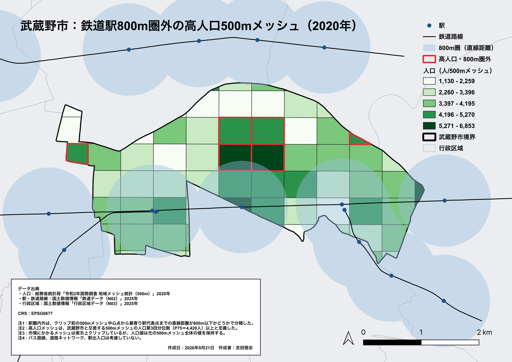
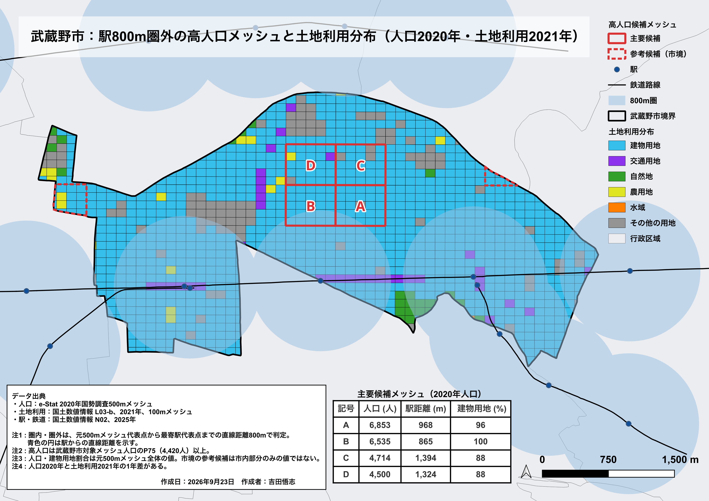
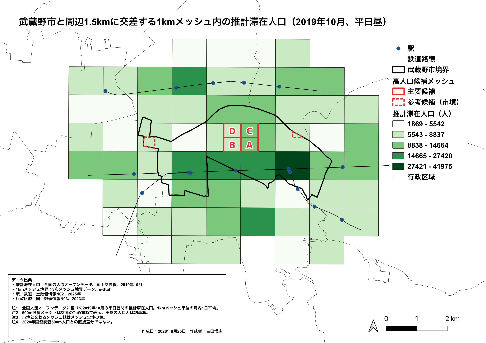

# GIS Mini-Project「武蔵野市における駅アクセスと都市構造」

作成日：2026年9月26日　作成者：吉田　悟志

 

#### 1. はじめに

&#12288;本分析プロジェクトでは東京都武蔵野市における駅アクセスと都市構造をテーマに、QGISを用いたデータの可視化および考察を行なった。自身の生活圏である武蔵野市を対象に居住人口の分布や都市構造との関係性について興味を持ったことがきっかけである。またプロジェクト型のQGIS学習という位置付けで、学習を行いながら成果物の製作を目的としている。
&#12288;本プロジェクトの主たる問いは、居住人口が多いが駅から離れているエリア（駅アクセス性は低いが人口は多い）は存在するか、そこにどういった都市構造が存在、関係しているかである。

#### 2. 分析方法

&#12288;QGISを用いて、武蔵野市ジオメトリと駅、鉄道路線、人口、土地利用、人流などのデータを重ね合わせマップを作成した。
まず2020年国勢調査人口のデータおよび500m境界メッシュを用いて、武蔵野市内における500mメッシュごとの居住人口の分布についてコロプレスマップを作成した。
&#12288;次に各500mメッシュの代表点から駅代表点までの直線距離を計算し、各500mメッシュの最寄駅までの直線距離を算出した。駅までの距離の基準を800m（直線距離で徒歩10分程度）に設定し分類を行うことで駅アクセス性について評価した。
続いて100mメッシュの土地利用データを用いて武蔵野市内の土地利用分布を可視化し、居住人口の分布と土地利用分類について評価した。
&#12288;最後に人流データを用いて、武蔵野市内の1kmメッシュにおける推計滞在人口を可視化した。対象データは2019年10月平日昼間のGPSデータに基づいた推計滞在人口である。これにより居住人口に対して平日昼間の各地点における滞在人口を観察し、現時点では補足的な都市活動の評価を行なった。

#### 3. 結果および考察

　図1に武蔵野市の500mメッシュにおける居住人口の分布と鉄道駅800m圏の関係を表したマップを示す。また表1に駅800m圏内外の統計量についてまとめ、表2には駅800m圏外のP75以上の高人口メッシュをまとめた。全69メッシュのうち、37メッシュ（53.6%）が最寄り鉄道駅から800m圏外に分類された。圏外メッシュの平均人口と中央値は圏内より低かったが、最大人口は圏内を上回った。P75以上の高人口かつ800m圏外となる候補は6件あり、このうち市境界メッシュを除く主要候補4件はすべて市北部中央に連続して分布し（図１の赤枠で表示）、最寄駅はいずれも三鷹駅だった。この結果から、市北部中央には鉄道駅への空間的近接性が相対的に低い高人口地域が集中している可能性が示された。今回設定した800mという距離はアクセス性を説明する絶対的基準ではなく500mメッシュ内でも距離は異なるため、単に駅から遠い高人口エリアと断定することはできないが、主要候補のうち北側２箇所は距離を1000m圏外としても該当する。

 

**図1　武蔵野市の500mメッシュにおける居住人口の分布と鉄道駅800m圏**

 

　　　　　　**表1　駅800m圏内と圏外の統計**
| 区分 | Count | Mean | Median | Maximum |
| -------- | ----- | ---- | ------ | ------- |
| 800m圏内 | 32 | 4014 | 3881 | 6130 |
| 800m圏外 | 37 | 3314 | 3384 | 6853 |

 

　　　　　**表2　駅800m圏外のP75以上の高人口メッシュ**
| rank | KEY_CODE | 人口（人） | 最寄駅 | 距離 (m) | 位置の説明 |
| ---- | --------- | ---- | ------ | ------ | ---------- |
| 1 | 533944551 | 6853 | 三鷹 | 968.4 | 市北部中央 |
| 2 | 533944542 | 6535 | 三鷹 | 864.6 | 市北部中央 |
| 3 | 533944553 | 4714 | 三鷹 | 1394.2 | 市北部中央 |
| 4 | 533944544 | 4500 | 三鷹 | 1324.2 | 市北部中央 |

 

　図２には駅800m圏外の高人口メッシュと武蔵野市全体の土地利用分類を表したマップを示す。図１のマップについて土地利用データを新たに適用しその分布を観察した。駅800m圏外かつ高人口の主要候補4メッシュでは、建物用地割合が88～100%（平均93%）だった。その他の完全市内メッシュ17件の平均82%を11ポイント上回り、候補地域は建物用地の多い市街地であることが確認できた。ただし、建物用地は住宅と商業・業務を区別しないため、この結果だけで高人口の要因や居住者の交通利便性は説明できない。
 

　**図2　駅800m圏外の高人口メッシュと武蔵野市全体の土地利用分類**

 

　図3には武蔵野市と周辺1.5kmに交差する1kmメッシュ内の推計滞在人口の分布を示す。1kmメッシュにおける2019年10月の平日昼間の推計滞在人口は、武蔵野市南部の鉄道沿線、とくに駅周辺を含む1kmメッシュで高い階級を示した。一方で市北部中央の駅800m圏外の高人口エリアを含む1kmメッシュは、最高階級には該当しなかった。このことから、居住人口が多い場所と平日昼間の滞在人口が多い場所の分布は、必ずしも一致しない可能性が考えられる。ただし、居住人口は2020年国勢調査の500mメッシュ、滞在人口は2019年の1kmメッシュの推計値であり、対象年・集計単位・算出方法が異なるため、数値の直接差分や因果関係の判断は行わず、市内の活動傾向を読み取るにとどめる。

 

**図3　武蔵野市と周辺1.5kmに交差する1kmメッシュ内の推計滞在人口**

### 5. Python実装

### 6. まとめ

　本分析では東京都武蔵野市における居住人口の分布の可視化を行い、駅から一定距離以上離れた高人口エリアの確認と、土地利用分布、人流データとの照合を行なった。その結果、市北部中央に駅800m圏外の高人口エリアが連続して存在し、建物用地の割合も高いことが確認された。また人流データから平日昼間の市内の活動状況を可視化し、南部の鉄道沿線に人口が集中すること、駅800m圏外の高人口エリアと平日昼間の人口密集エリアは異なる可能性があることが示唆された。
　今回の分析結果では、駅までの距離と居住人口の関係や、土地利用分布との関係、人流データとの差分などについて、可視化して読み取れること、相関がありそうな事柄について確認したが、直接的に因果関係を説明することはできない。より詳細な分析には次のような課題が考えられる。徒歩経路の設定、バス等鉄道以外の交通手段の影響、土地利用分類の細分化、年度差、1km/500mメッシュの粒度差、測定法の違い、市境メッシュの扱いなど。

### 7. データ出典

[1] 行政区域：国土数値情報N03、2023年
[2] 人口：2020年国勢調査　e-Stat
[3] 駅、鉄道：国土数値情報N02、2025年
[4] 500m境界メッシュ：国土数値情報N03
[5] 100m土地利用メッシュ：国土数値情報 L03-b、2021年
[6] 1kmメッシュ：３次メッシュ境界データ　e-Stat
[7] 推計滞在人口：全国の人流オープンデータ　国土交通省、2019年10月

### 8. 参考文献

[1] QGIS リソース（https://www.qgis.org/ja/resources/hub/）
